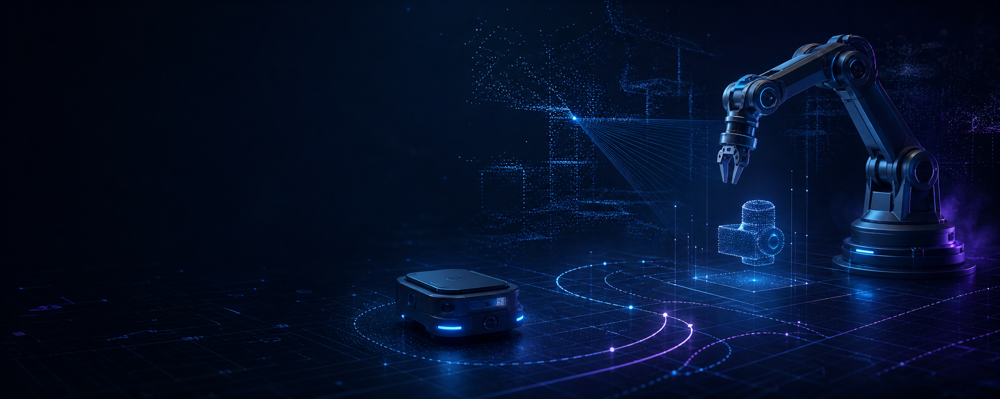

<div align="center">



# Hi, I'm kbsybf

### Robotics × Embedded Systems × Embodied AI

关注机器人、嵌入式系统、电机控制、ROS 2 与具身智能  
记录从底层控制到具身智能的长期技术成长

[](https://kbsybf.github.io/kbsybf/)
[](https://github.com/kbsybf)
[](#current-focus)

**让机器人从可靠执行走向环境理解与自主决策。**

</div>

---

<div align="center">

[About](#about-me) · [Roadmap](#learning-roadmap) · [Notes](#technical-notes) · [Projects](#projects) · [Research](#research--paper-reading) · [Industry](#industry-research) · [Goals](#goals)

</div>

<a id="about-me"></a>
## About Me

我专注于机器人技术的长期学习与实践，希望沿着 **底层控制 → 嵌入式系统 → 机器人软件 → 具身智能** 的路径，建立对完整机器人系统的理解。

- **当前研究方向：** 机器人系统、嵌入式开发、电机控制、ROS 2、具身智能（Embodied AI）
- **技术兴趣：** 实时控制、运动控制、机器人中间件、感知与决策、VLA（Vision-Language-Action）
- **长期关注：** 机器人软硬件协同、具身基础模型、人形机器人技术路线与产业演进
- **开源理念：** 用代码、技术笔记和项目复盘记录真实成长过程

<a id="current-focus"></a>
### Current Focus

```text
Reliable Motion  →  Real-time Systems  →  Robot Autonomy  →  Embodied Intelligence
  Motor Control       Embedded / RTOS       ROS 2 / Robotics       VLA / Embodied AI
```

### Technology Stack

<p align="center">
  
  
  
  
  
  
  
  
  
  
  
  
</p>

> 技术栈代表当前学习与长期建设方向，将随着项目实践持续更新。

<a id="learning-roadmap"></a>
## Learning Roadmap

| 阶段 | 学习方向 | 核心内容 | 目标输出 |
|:---:|---|---|---|
| 01 | **C / C++** | 语言基础、数据结构、现代 C++、工程化与调试 | 可维护的机器人与嵌入式代码 |
| 02 | **Embedded Systems** | MCU、外设驱动、通信协议、硬件接口与系统调试 | 完整嵌入式项目与驱动笔记 |
| 03 | **Motor Control** | 电机模型、FOC、PID、编码器、功率驱动与控制环 | 电机控制实验、参数分析与复盘 |
| 04 | **FreeRTOS** | 任务调度、中断、队列、信号量、实时性与资源管理 | 多任务实时控制系统 |
| 05 | **ROS 2** | Node、Topic、Service、Action、TF、Launch 与 DDS | 模块化机器人软件系统 |
| 06 | **Robotics** | 运动学、动力学、定位建图、规划、控制与系统集成 | 可运行、可复现的机器人项目 |
| 07 | **Embodied AI / VLA** | 多模态表征、模仿学习、强化学习、VLM 与 VLA | 论文复现、实验记录与趋势判断 |

<a id="technical-notes"></a>
## Technical Notes

计划将学习过程整理为结构化、可检索、可复现的技术资料。

| 笔记方向 | 内容范围 | 建设目标 |
|---|---|---|
| **机器人基础** | 坐标变换、运动学、动力学、规划与控制基础 | 建立机器人系统知识骨架 |
| **嵌入式开发** | MCU 外设、通信协议、实时系统、调试与工程规范 | 沉淀可复用的开发方法 |
| **电机控制** | 电机原理、FOC、控制器设计、采样与驱动 | 连接理论、代码与真实硬件 |
| **ROS 2 学习笔记** | 通信机制、TF、Launch、Nav2、MoveIt 2 与系统集成 | 构建机器人软件工程能力 |
| **算法与控制** | PID、状态估计、优化、轨迹规划与现代控制 | 从公式推导走向工程实现 |
| **论文阅读** | 机器人学习、VLA、具身智能与人形机器人 | 形成问题意识与研究判断 |

<details>
<summary><b>笔记方法：从“读过”变成“掌握”</b></summary>

1. 先明确问题、输入输出和使用场景。
2. 梳理关键概念、数学基础与系统约束。
3. 用最小代码或实验验证核心结论。
4. 记录失败现象、调试路径和工程取舍。
5. 总结可迁移的方法，并持续迭代。

</details>

<a id="projects"></a>
## Projects

项目将围绕“从底层执行到高层智能”的完整技术链持续建设。

| 项目方向 | 计划覆盖 | 代表性输出 | 状态 |
|---|---|---|:---:|
| **嵌入式项目** | MCU 驱动、传感器、通信、实时任务与系统联调 | 源码、硬件说明、调试记录 | `Building` |
| **电机控制项目** | 编码器采样、闭环控制、FOC、参数整定与性能分析 | 控制代码、实验曲线、技术复盘 | `Roadmap` |
| **ROS 2 项目** | 节点通信、TF、导航、机械臂与仿真 | ROS 2 Package、Launch、Demo | `Roadmap` |
| **机器人系统开发** | 感知、规划、控制、嵌入式执行与系统集成 | 端到端机器人系统与文档 | `Long-term` |

> 仓库会优先保证：**问题清晰、代码可读、实验可复现、结论有边界。**

<a id="research--paper-reading"></a>
## Research & Paper Reading

### Robotics

- 机器人运动学、动力学、规划与控制的经典方法
- 机器人感知、状态估计与软硬件系统协同
- 模仿学习、强化学习与机器人操作

### Embodied AI & VLA

- VLM 到 VLA 的能力迁移与系统架构
- 机器人数据采集、数据质量与泛化能力
- 真实机器人部署中的实时性、安全性和可靠性
- 具身基础模型与传统机器人技术的结合方式

### Paper Review Template

每篇关键论文将重点记录：

`研究问题` → `核心方法` → `实验设置` → `关键结论` → `局限性` → `工程价值` → `个人思考`

<a id="industry-research"></a>
## Industry Research

除了技术实现，我也关注机器人从实验室走向真实产业的路径。

| 观察方向 | 核心问题 |
|---|---|
| **人形机器人产业分析** | 为什么选择人形？落地场景、成本结构与量产瓶颈是什么？ |
| **机器人公司研究** | 不同公司的产品定位、技术壁垒、团队能力和商业模式如何？ |
| **技术路线分析** | 端到端与分层架构、纯视觉与多传感器、通用与专用如何取舍？ |
| **行业趋势观察** | 核心零部件、数据闭环、基础模型与规模化部署将如何演进？ |

我希望把产业研究建立在技术理解之上：不仅关注“发生了什么”，也追问 **为什么这样设计、约束在哪里、是否能够规模化**。

<a id="goals"></a>
## Goals

- 成长为能够理解完整系统、解决真实问题的机器人技术研发人员
- 持续积累机器人底层技术、系统工程能力与产业认知
- 深入理解嵌入式、电机控制、ROS 2 与具身智能之间的连接
- 用开源方式分享学习过程、项目实践、论文阅读和技术思考
- 长期保持对技术边界、工程价值与行业变化的独立判断

## GitHub Activity

<div align="center">

<picture>
  <source media="(prefers-color-scheme: dark)" srcset="https://github-readme-stats.vercel.app/api?username=kbsybf&show_icons=true&include_all_commits=true&hide_border=true&theme=github_dark&locale=cn&rank_icon=github" />
  <source media="(prefers-color-scheme: light)" srcset="https://github-readme-stats.vercel.app/api?username=kbsybf&show_icons=true&include_all_commits=true&hide_border=true&theme=default&locale=cn&rank_icon=github" />
  
</picture>

<picture>
  <source media="(prefers-color-scheme: dark)" srcset="https://github-readme-stats.vercel.app/api/top-langs/?username=kbsybf&layout=compact&hide_border=true&theme=github_dark&locale=cn" />
  <source media="(prefers-color-scheme: light)" srcset="https://github-readme-stats.vercel.app/api/top-langs/?username=kbsybf&layout=compact&hide_border=true&theme=default&locale=cn" />
  
</picture>

</div>

---

<div align="center">

### Build deeply. Think independently. Share openly.

这个主页会随着学习、研究和项目实践持续生长。

[查看技术成长网站](https://kbsybf.github.io/kbsybf/) · [浏览 GitHub 仓库](https://github.com/kbsybf?tab=repositories)

</div>
